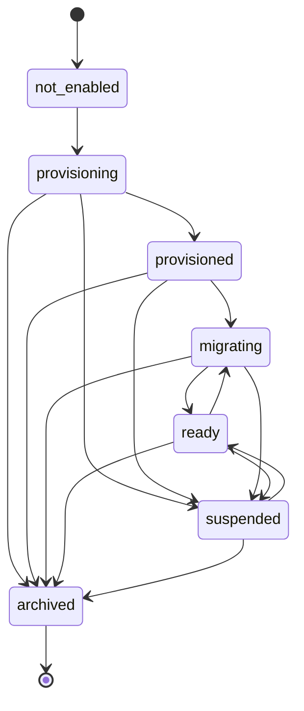

# Phase 1A Lifecycle State Machine

## States

| State | Meaning |
| --- | --- |
| `not_enabled` | No accounting registry exists for the parish. |
| `provisioning` | Accounting has been registered and awaits provisioning completion. |
| `provisioned` | A registry database row exists and provisioning is marked complete. |
| `migrating` | The database is in schema migration/validation flow. |
| `ready` | The database registry row is safe for future accounting services. |
| `suspended` | Accounting exists but must not be used. |
| `archived` | Accounting is closed/archived and must not be used. |

## Legal Transitions

## Enforcement

`assertAccountingLifecycleTransition()` rejects any transition not listed above.

## Activation Status

Activation status is derived from lifecycle:

- `ready` -> `active`
- `suspended` -> `suspended`
- `archived` -> `archived`
- all other states -> `inactive`

## Audit

Every lifecycle operation records:

- a central `audit_log` row
- a row in `accounting_lifecycle_events`

Validation failures write `accounting.validation_failed` to the central audit log.
