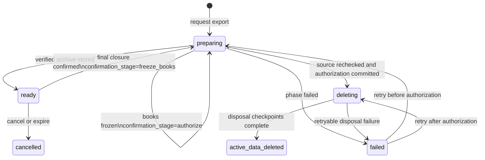

# Parish portability debugging guide

This guide is the short path through the portability system. The implementation
is deliberately split between runtime code, release evidence, and operator-only
tools. Do not combine those layers when diagnosing a failure.

## Footprint and boundaries

The runtime implementation lives in `src/portability/`. The large files under
`scripts/` are tests, staging drills, recovery exercises, and narrowly scoped
production operators; they are not shipped as request-path code.

| Concern | Primary file |
| --- | --- |
| Policy versions and parish-facing retention copy | `src/portability/policy.js` |
| Job scheduling and state transitions | `src/portability/service.js` |
| Export collection and manifest construction | `src/portability/export.js` |
| Reviewed central schema, ownership, and redaction | `src/portability/schema.js`, `src/portability/catalog.js` |
| Closure blockers, write barriers, and central purge plan | `src/portability/closure.js` |
| Separate accounting database export and freeze | `src/portability/accounting.js` |
| File and legacy-data disposition | `src/portability/disposal.js`, `src/portability/legacy.js` |
| Storage writer fencing and object ownership | `src/portability/storage.js` |
| Independent closure markers and restore quarantine | `src/portability/suppression.js`, `src/portability/restore.js` |
| Per-invocation operation limits | `src/portability/budget.js` |
| Authenticated API boundary | `src/handlers/parish-portability.js` |
| Parish browser workflow | `public/parish/portability.js` |

Dependency direction should remain one way: the handler calls the service and
policy modules; the service orchestrates domain modules; domain modules depend
on catalog/schema and storage primitives. Domain modules must not import the
handler or browser code.

## Job state map

The five-minute scheduler advances at most one job and one durable phase per
invocation.



`confirmed_at` is the point of no return. A job before that timestamp may release
its fences. A job after it must resume deletion and may not be reset to an
ordinary export.

## Read-only triage

Start with the job row and its confirmation stage. Do not inspect or copy
`manifest_json` unless an approved incident procedure requires it; it describes
private parish data.

```sql
SELECT
  j.id,
  j.status,
  j.error_code,
  j.confirmed_at,
  j.updated_at,
  json_extract(s.result_json, '$.stage') AS confirmation_stage
FROM parish_portability_jobs j
LEFT JOIN parish_portability_steps s
  ON s.job_id = j.id
 AND s.step_key = 'confirmation_v1'
 AND s.status = 'pending'
WHERE j.id = ?;
```

Then use the narrowest matching area:

| Symptom or error family | Inspect first |
| --- | --- |
| `portability_disabled`, `portability_unavailable` | Worker feature flags and private export binding |
| `unclassified_*`, `schema_*` | Reviewed schema files and the schema audit |
| `archive_*`, `export_*` | Export manifest construction and private R2 object metadata |
| `closure_unavailable`, `closure_blocked` | `closureReadiness()` blocker codes; do not infer from one flag |
| `backup_*` | Strict-expiry evidence object and backup lifecycle report |
| `storage_*`, `file_*`, `legacy_*` | Writer-operation table, ownership inventory, and convergence evidence |
| `confirmation_*`, `wrong_actor` | Job status, `confirmed_at`, and `confirmation_stage` |
| `write_barrier_missing`, `*_WRITE_BLOCKED` | Generated barrier SQL versus installed trigger definitions |
| `cache_*`, `retention_*` | Disposal checkpoints and restricted retention records |
| Restore quarantine errors | Independent closure ledger and suppression replay evidence |

Never repair a portability job with an ad hoc `UPDATE` or by deleting a closure
marker. Use the documented recovery operator for the failed boundary; those
operators default to plan/read-only mode and require fresh evidence for writes.

## Test ladder

Run the smallest relevant gate first, then widen:

```text
npm run test:parish-portability
npm run test:parish-portability-runtime
npm run test:portability-query-budget
npm run test:portability-volume
npm run test:parish-portability-browser
npm run check
```

- The first command covers domain behavior and failure recovery in memory.
- The runtime drill covers native Worker, D1, R2, and KV behavior.
- Query-budget and volume gates catch provider-limit and scale regressions.
- The browser gate checks MFA, billing cancellation, local ZIP verification, and
  the rule that download alone never authorizes deletion.
- The full check is required before deployment.

## What should remain separate

The production audit, storage audit, public-media audit, backup lifecycle,
quarantined restore, provider multistore restore, and staging/volume drills have
overlapping setup. They remain separate because each has a different permission
boundary and failure consequence. Consolidating them into a single privileged
CLI would reduce filenames while increasing its blast radius and making an
operator mistake harder to contain.
